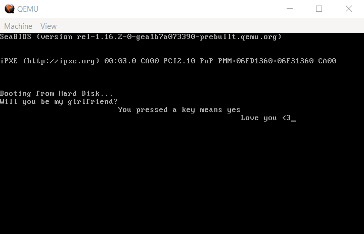

# DATOS

DateOS (Date Operating system) AKA DATOS is a simple bootloader than asks a girl, if she presses any key, she will agree.
## Nerds now you will always get a yes

### Demo

### Idea
This is a challenge that I got to create input/output in a bootloader about this topic using x86 Assembly.
